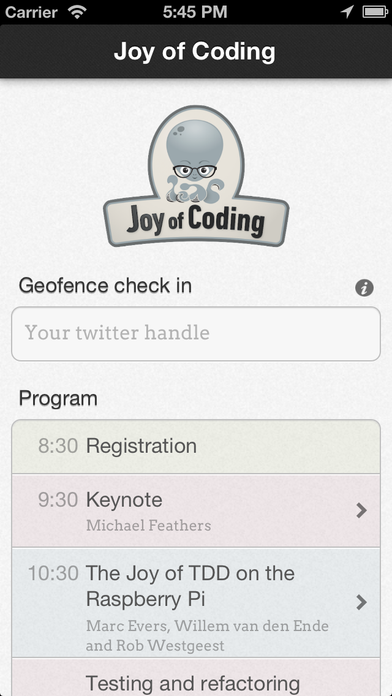

### Joy of Coding conference 2013 iOS app

This application provides the session schedule and a geo-fence 'check in' function for the Joy of Coding conference in Rotterdam, held on March 1st, 2013. 

[Joy of Coding](http://joyofcoding.org/) is a one-day conference that celebrates the art, craft, science, but foremost the joy of software development. 

Fill in your Twitter handle in the 'check in'-field to allow the application to monitor your location. You will be 
automatically checked in when you arrive at the conference venue. A projector will be used during the conference to display Twitter avatars of those checked in at the conference at the given time.

**About:**

This app was built in 6 hours on top of an existing Geofence application, Lunatech's [check-in](https://github.com/lunatech-labs/lunatech-check-in).

Checked in users are listed at joyofcoding.lunatech.com.

**Build requirements:**

- Xcode 4.4 or newer
- iOS 5.0 SDK or newer
